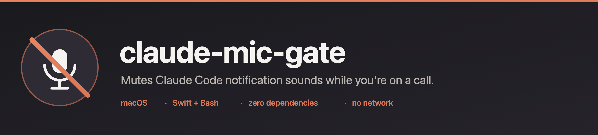

<p align="center">
  
</p>

<p align="center">
  <a href="https://github.com/tripp2acst/claude-mic-gate/actions/workflows/codeql.yml"></a>
  <a href="https://github.com/tripp2acst/claude-mic-gate/actions/workflows/shellcheck.yml"></a>
  
  
  
  
  
  <a href="LICENSE"></a>
</p>

Silence your [Claude Code](https://claude.com/claude-code) sound hooks while you're on a call — automatically, using your own sounds.

If you wired up notification sounds for Claude Code (permission prompts, task-complete "tada", etc.), they're great until you're in a Microsoft Teams / Zoom / Meet meeting and your laptop starts blasting sound effects into the call. This is a tiny gate that mutes those sounds whenever your microphone is actually live, and lets them through the rest of the time. Nothing else about your setup changes — same sounds, same hooks.

You don't lose the alert, just the noise: while you're on a call the gate posts a **silent macOS notification banner** instead of playing the sound, and the banner names the **project and IDE** that fired it — so if you run several Claude Code sessions at once, you still know which one needs you.

## Why not just check if Teams is running?

Because that's a false-positive machine. Modern Teams keeps ~15 helper processes (and macOS keeps the camera daemon `appleh16camerad`) alive 24/7, so "is a conference app running" is true all day whether or not you're in a call. The classic `ioreg` microphone check (`IOAudioEngineState`) only works on Intel Macs — on Apple Silicon that key isn't present, so it silently never fires.

The reliable, architecture-independent signal is CoreAudio's `kAudioDevicePropertyDeviceIsRunningSomewhere` on your input devices — the exact flag behind the macOS orange microphone dot. It's true only when something is actively capturing the mic (i.e. you're on a call), and false when the app is merely open. That's what this uses.

## How it works

- **`mic-in-use.swift`** — a ~50-line Swift program. Compiles to a tiny binary that exits `0` if any audio *input* device is currently capturing, `1` otherwise. Output-only devices (music, videos) don't count.
- **`cm-gate.sh`** — a wrapper you point your sound hooks at. It plays the sound file you pass it, *unless* `mic-in-use` reports the mic is live — in which case it stays silent and posts a notification banner (via macOS's built-in `osascript`) titled with the project and IDE, so multi-session setups stay legible. **Fails open**: if the helper is missing or errors, the sound still plays — you can never end up silent-forever.

  ```
  cm-gate.sh <sound-file> [notification-message]
  ```

  The optional second argument is the text shown on the banner while you're on a call (e.g. `"Claude finished"`). The project name is read from the Claude Code hook payload's `cwd`; the IDE/terminal is inferred from `$TERM_PROGRAM`.

## Requirements

- macOS (Intel or Apple Silicon)
- Swift toolchain to compile the helper — either Xcode or the Command Line Tools: `xcode-select --install`
- Claude Code with sound hooks you want to gate

## Install

```sh
git clone https://github.com/tripp2acst/claude-mic-gate.git
cd claude-mic-gate
./install.sh
```

`install.sh` compiles `mic-in-use` and copies it plus `cm-gate.sh` into `~/.claude/hooks/`, then prints the hook snippet to add to your `~/.claude/settings.json`.

## Wire it into Claude Code

Point any sound hook at `cm-gate.sh <path-to-sound> <message>` instead of calling the player directly. Example `~/.claude/settings.json`:

```json
{
  "hooks": {
    "Notification": [
      {
        "matcher": "permission_prompt",
        "hooks": [
          { "type": "command", "command": "bash ~/.claude/hooks/cm-gate.sh ~/sounds/ping.mp3 'Claude needs your permission'" }
        ]
      }
    ],
    "Stop": [
      {
        "hooks": [
          { "type": "command", "command": "bash ~/.claude/hooks/cm-gate.sh ~/sounds/done.mp3 'Claude finished'" }
        ]
      }
    ]
  }
}
```

Use whatever sound files you like — `cm-gate.sh` just plays `$1` via `afplay`. The `$2` message is what the banner says when you're on a call. Hooks are read at session start, so restart Claude Code after editing settings.

### Seeing the banners

macOS attributes `osascript` notifications to **Script Editor**, so you need to allow them once: **System Settings → Notifications → Script Editor → Allow Notifications** (style: Alerts or Banners). If you run a Do Not Disturb / meeting Focus during calls, macOS holds the banner in Notification Center rather than popping it — expected, and usually what you want mid-call.

## Test it

```sh
# Not on a call -> you hear it
bash ~/.claude/hooks/cm-gate.sh ~/sounds/done.mp3

# Now join a Teams/Zoom/Meet call (mic on), then run the same command -> silence.
# Leave the call, run again -> the sound is back.
```

## Notes

- This keys off the **microphone**, not any specific app — so any call (Teams, Zoom, Meet, FaceTime, phone hand-off, a browser call) will mute your sounds. That's usually what you want; there's no per-app allowlist.
- Push-to-talk voice dictation also uses the mic, but only while you hold the key — completion sounds fire *after* you release, so they won't get swallowed in practice.
- The compiled binary is architecture-specific and isn't committed; `install.sh` builds it locally. To rebuild manually: `swiftc -O mic-in-use.swift -o mic-in-use`.

## Security and privacy

This tool touches your microphone, so it's fair to ask what it does with it. The short version: it reads a status flag, never any audio.

- **No audio is captured or recorded.** `mic-in-use` only reads CoreAudio's `kAudioDevicePropertyDeviceIsRunningSomewhere` boolean — the same flag that lights the macOS orange mic dot. It opens no input stream and buffers no samples.
- **No network.** Nothing here makes a network call. No telemetry, no analytics, no update check. Nothing about your mic state, your calls, or your usage leaves the machine. The on-call banner is a local `osascript` notification — it posts to macOS Notification Center and goes nowhere else.
- **No elevated privileges.** It runs as you, reads a public IORegistry/CoreAudio property, and plays a sound file via `afplay`. No `sudo`, no daemon, no persistence beyond the two files in `~/.claude/hooks/`.
- **Auditable in minutes.** The whole thing is ~50 lines of Swift plus two short shell scripts, all in this repo. The committed source is what runs — the binary is compiled locally by `install.sh`, never downloaded.
- **Continuously scanned.** Every push runs [CodeQL](https://github.com/tripp2acst/claude-mic-gate/actions/workflows/codeql.yml) against the Swift and [ShellCheck](https://github.com/tripp2acst/claude-mic-gate/actions/workflows/shellcheck.yml) against the shell scripts (see the badges above).

macOS may prompt no one for microphone access here, because the running-state flag isn't protected input — the gate never actually listens.

## License

MIT
